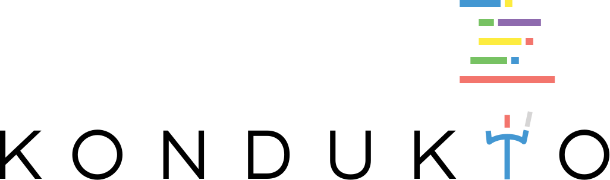
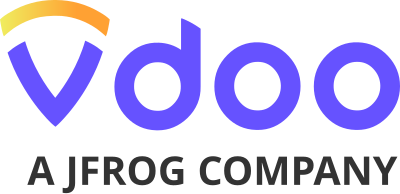

---

title: Supporters
displaytext: Our Supporters
layout: null
order: 3
tab: true
tags: cyclonedx bom sbom  scrm cscrm transparency supply-chain

---

Dependency-Track is developed by a worldwide team of volunteers.

But we have also been helped by many organizations, either financially or by encouraging their employees to work on Dependency-Track:

<link rel="stylesheet" href="assets/style.css">

## Financial Supporters

  

    
  

  

    
  

  

    
  

## Industry Working Group Supporters

  

    
  

  

    
  

  

    
  

  

    
  

  

    
  

  

    
  

  

    
  

  

    
  

Visit [https://cyclonedx.org/about/supporters/](https://cyclonedx.org/about/supporters/) for a comprehensive list
of all known vendors and projects that support the CycloneDX standard.
